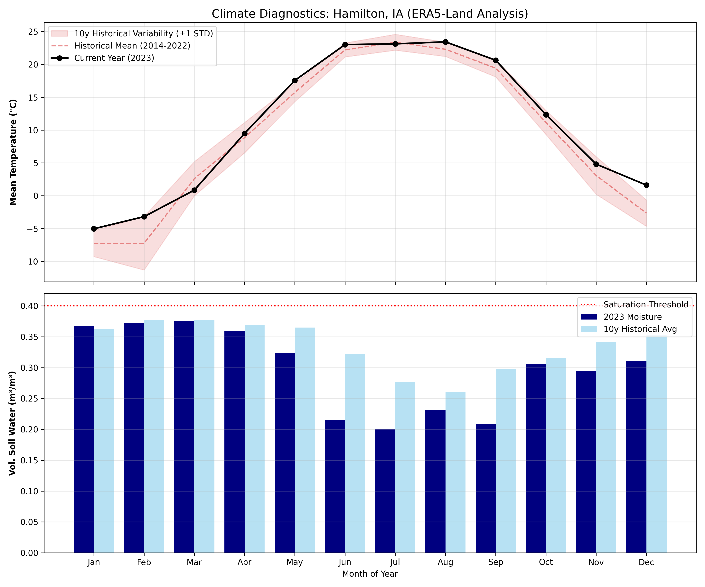
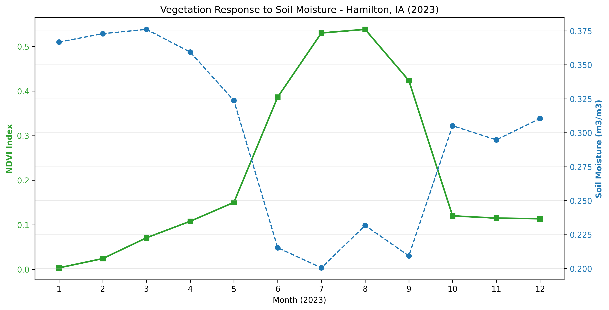
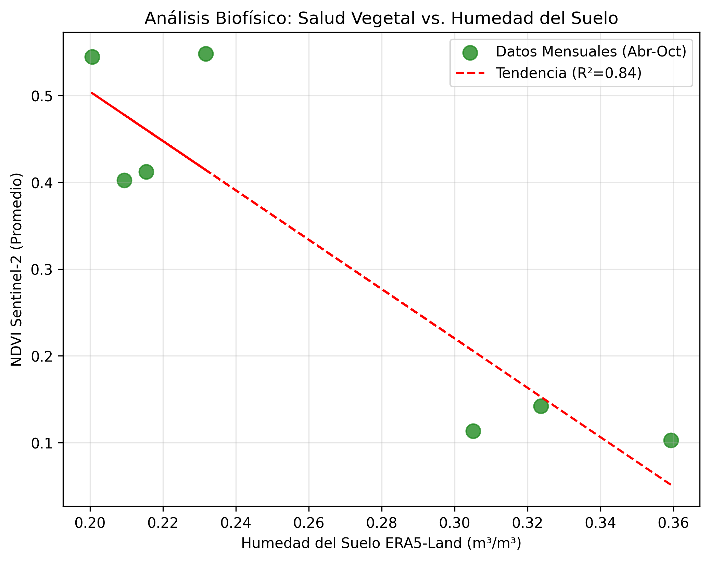
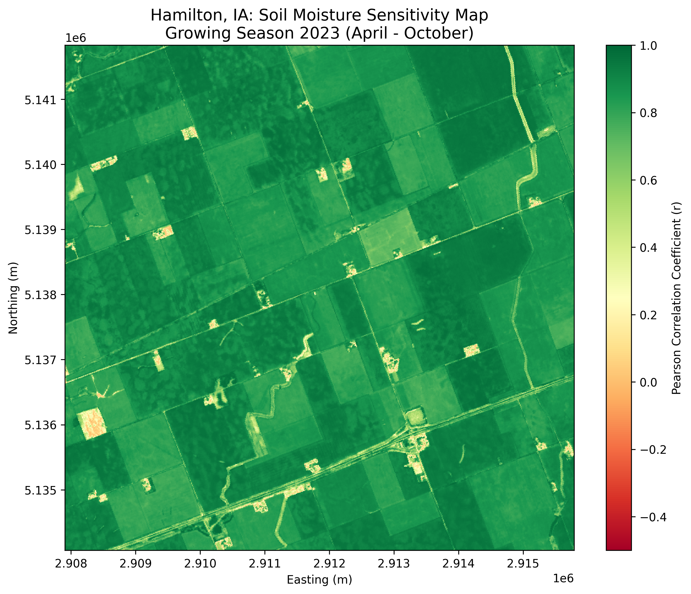

# 🛰️ Agri-Intelligence Spatial Correlation: Hamilton, IA
### **Predictive Biophysical Modeling: Sentinel-2 & ERA5-Land Integration**

---

## 🚀 Strategic Value Proposition
Understanding crop performance requires more than just looking at a green map. This engine synchronizes **Sentinel-2 Multispectral Data (10m)** with **ERA5-Land Soil Moisture (9km)** to quantify the biological efficiency of a field. By measuring the **"Mirror Effect"** between vegetation vigor and water depletion, we provide a high-resolution diagnostic of crop health and resilience.

**Key Business Benefits:**
* **Resource Optimization:** Identify exactly which areas of a lot are most sensitive to water stress.
* **Resilience Validation:** Scientifically prove if a crop is effectively utilizing soil moisture during peak summer (Evapotranspiration monitoring).
* **Data-Driven Auditing:** High-precision metrics ($R^2$, $p$-value) to back up management decisions before stakeholders.

---

## 📊 Analytical Deliverables & Insights

### 1. Historical Climate Context
Before analyzing the current season, the system evaluates the **10-year soil moisture baseline**. This ensures that the 2023 observations are interpreted within the correct climatic frequency (Normal vs. Drought years).

<p align="center">
  
</p>


### 2. Biophysical "Mirror Effect" (2023)
By overlapping **NDVI** and **Soil Moisture** time series, we visualize the temporal synchronization of the crop. A healthy, high-yield metabolism is characterized by a synchronized depletion of water as biomass peaks.

<p align="center">
  
</p>


### 3. Statistical Precision & Regression
We don't just show correlations; we prove them. The model achieved a **Pearson $r$ of -0.915**, indicating that **83.7%** of the crop's vigor is directly explained by active water transpiration dynamics.

| Metric | Value | Interpretation |
| :--- | :--- | :--- |
| **Pearson (r)** | **-0.915** | Extremely strong inverse correlation (Active consumption). |
| **R-Squared ($R^2$)** | **83.7%** | High predictive power of soil moisture over biomass. |
| **p-value** | **0.00388** | 99% Statistical confidence. |

<p align="center">
  
</p>

### 4. Spatial Sensitivity Map (Pearson r)
A high-resolution raster (10m/pixel) that identifies "Water-Usage Zones". Red/Yellow zones (in inverse logic) represent the most productive areas where the plant-soil-atmosphere continuum is optimized.

<p align="center">
  
</p>

---

## 🛠️ Technical Workflow & Criteria
The system processes millions of pixels using a **Time-Series Alignment** method to match satellite irregular captures with monthly climate reanalysis.

1. **Data Ingestion:** Sentinel-2 L2A (Multispectral) + ERA5-Land (swvl1).
2. **Preprocessing:** Cloud masking, NDVI calculation, and spatial resampling.
3. **Statistical Engine:** Pixel-level Pearson correlation and significance testing.
4. **Automated Reporting:** 3-page professional PDF generation with `fpdf2`.

---

## 💻 Software Architecture
This is a **productized pipeline** built for scalability and low-resource consumption by using local data cubes (`.nc`).

```text
NDVI_temporal/
│
├─ scripts/                 # Source code (Serialized execution)
│   ├─ 03_ndvi_temporal.py  # Ingests API data & creates local NetCDF cube
│   ├─ 07_pearson_map.py    # Spatial downscaling & pixel-level correlation
│   ├─ 08_statistics.py     # Scipy engine for R2 and P-Value validation
│   └─ 09_generate_pdf.py   # Automated English Professional Reporting
│
├─ data/                    # Datasets (ERA5 & Shapefiles)
│   └─ clima_historico_10y.nc
│
├─ outputs/                 # Results & Artifacts
│   ├─ ndvi_cube_2023.nc    # Serialized satellite data cube
│   ├─ spatial_correlation_map.png
│   ├─ scatter_correlation.png
│   └─ Final_Report_Hamilton_Professional.pdf
│
├─ README.md
├─ requirements.txt  
└─ .gitignore
```

---

## 👨‍💻 Author & Consultancy
**Santiago Gallego** Agronomist Engineer | Geospatial Software Developer I bridge the gap between **Agronomy**, **Data Science**, and **GIS** to provide actionable intelligence for the AgTech sector.

